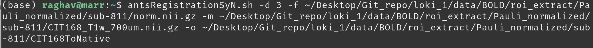
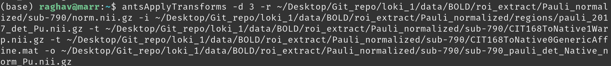
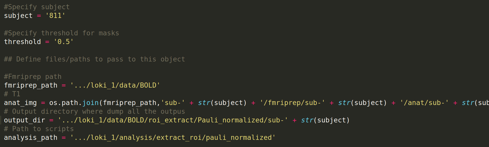
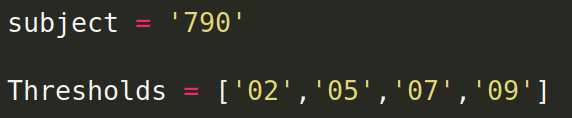
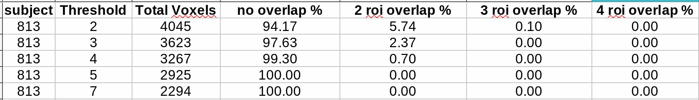
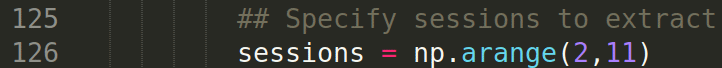

#ROI voxel extraction

### Pauli Deterministic atlas ("loki_1/analysis/extract_roi/pauli_2017") (Download from below if starting from scratch)
    • Pauli Det is based on CIT168 template. (https://osf.io/jkzwp/)
    • Pre-existing scripts to work with pauli’s atlases. (https://github.com/wmpauli/atlaskit)

### 1. Extract individual labels from Pauli Deterministic atlas
- Extracted data stored in - "loki_1/data/BOLD/roi_extract/Pauli_normalized/regions"
- If re-extract needed
 	+ Use the script "loki_1/analysis/extract_roi/pauli_2017/separate_labels.py"
 	+ The output labels are not marked as per ROI format. Refer to “pauli_2017/labels.txt” to manually modify label names. This step needs to be done once.

### 2. Normalize roi masks to native space
- Install (compile) ANTs tool on the local machine. Follow the instructions here - "https://github.com/ANTsX/ANTs/wiki/Compiling-ANTs-on-Linux-and-Mac-OS”
- Apply ants registration using “**antsRegistrationSyN.sh**” to create needed affines for the next step. (This step might take 4-8 hours)
[https://www.rdocumentation.org/packages/ANTsR/versions/1.0/topics/antsRegistration ]
[https://github.com/ANTsX/ANTs/wiki/Anatomy-of-an-antsRegistration-call]

	+ -d :  dimensionality
	+ -f : fixed image (use norm.nii.gz file from fmriprep output - “/sub-.../freesurfer/sub-.../mri/norm.nii.gz){used norm file as it is skull stripped}
	+ -m: moving image (use CIT168_T1w_700um.nii.gz file. This is the base template for Pauli deterministic atlas)
	+ -o : output files naming convention 
	+ **Command example-**
	

	+ **Output files-**
	(depends on the naming convention)

	

- Apply “**antsApplyTransforms**” to each ROI totransform them to native space. [http://manpages.org/antsapplytransforms]
	+ -d :  dimensionality
	+ -r : reference image (use norm.nii.gz)
	+ -i : input roi mask in CIT space (extracted in step 1)
	+ -t : transform files
	a) CIT168ToNative1Warp.nii.gz (output of antsRegistration)
	b) CIT168ToNative0GenericAffine.mat (output of antsRegistration)
	+ -o: output roi mask in native space

	+ **Command example-**
	

- Repeat this step for all 16 roi labels (takes a few seconds for each) (can be automated)
- Do a quick visual check to see if all ROIs are where they are supposed to be.

### 3. Voxel Overlap analysis

- Prepare files for threshold analysis

- open “loki_1/analysis/extract_roi/pauli_normalized/**extract_roi_Pauli.py**” in a text editor.
	+ Specify “subject”
    + Specify “intended threshold” 
    + Modify filepaths for -
    	* fmriprep_path
    	* anat_img
        * output_dir
        * analysis_path
    
    

- Next open file “**loki_1/analysis/extract_roi/pauli_normalized/src/masking.py**". Comment out code for **section 2** (~ line 130) for overlap analysis. (Uncomment this section once overlap analysis is done) 
	+ This step saves time

- repeat step above at multiple thresholds (0.1,0.2,…..0.9)
- open overlap_analysis.py file and modify subjects and thresholded values needed for analysis.
 

- Output is a csv file with voxel overlap percentages.

### 4. Extract Voxel data using the obtained masks and threshold

- **Note**:  if script is being run for limited sessions, change input to sessions at line 126 in “/src/masking.py”
 

- Run the **extract_roi_Pauli.py** python file (This step should take a couple of hours per subject)
- Next, go to "loki_1/data/BOLD/roi_extract/Pauli_normalized/sub-xxx" and arrange the files looking at previous subjects as reference (Manual cleanup)

