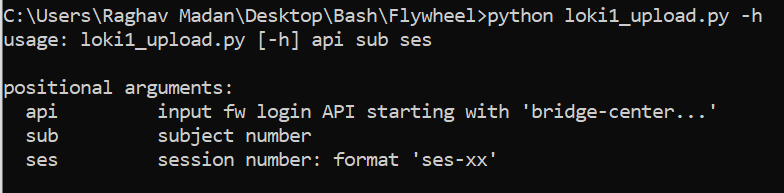

# Events file upload to Flywheel

##Steps to set up-

- Setup Flywheel account, access and Api-key 
https://docs.flywheel.io/hc/en-us/articles/360019252953-CLI-fw-upload

- Download FW CLI to the target directory from profile settings of your Flywheel account

- Get access to loki1 repository and Download SSH key for Github for your system
https://help.github.com/en/articles/adding-a-new-ssh-key-to-your-github-account

- Open fw_file_path.txt and change the file path to the directory with FW CLI

- Ensure the particular subject and session with BIDS data exists in FW before running this script

## Initiate upload from command prompt – 

- Open command prompt
- Login to Flywheel -  Fw login “api_key”
- Download Repository from Github. 
    + If fetching repo for the first time- python loki1_git_fetch.py
    + If pulling repo updates – python loki1_git_pull.py
- Run script to upload event files – python loki1_upload.py -api “api key” -sub “subject number” -ses “session number”

