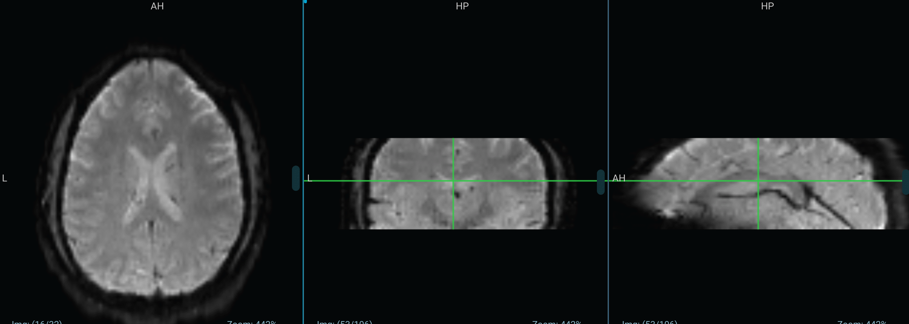
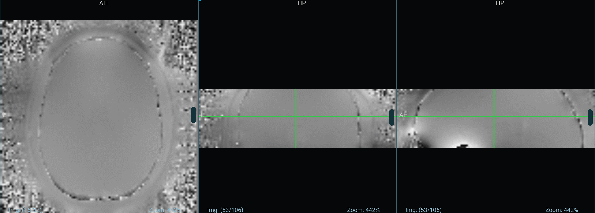

# FMRIPREP (FLYWHEEL and execution)

##Flywheel

### a.) Files needed for fmriprep processing
#### Anat
		sub-xxx_ses-xx_T1w.nii.gz
		sub-xxx_ses-xx_T1w.json 
#### Fmap
		sub-xxx_ses-xx_acq-epi_magnitude1.nii.gz
		sub-xxx_ses-xx_acq-epi_magnitude1.json
		sub-xxx_ses-xx_acq-epi_phasediff.nii.gz
		sub-xxx_ses-xx_acq-epi_phasediff.json
#### Func
		sub-xxx_ses-xx_task_lokicat_run-01_bold.nii.gz
		sub-xxx_ses-xx_task_lokicat_run-01_bold.json
		sub-xxx_ses-xx_task_lokicat_run-02_bold.nii.gz
		sub-xxx_ses-xx_task_lokicat_run-02_bold.json
		sub-xxx_ses-xx_task_lokicat_run-03_bold.nii.gz
		sub-xxx_ses-xx_task_lokicat_run-03_bold.json
		sub-xxx_ses-xx_task_lokicat_run-04_bold.nii.gz
		sub-xxx_ses-xx_task_lokicat_run-04_bold.json
		sub-xxx_ses-xx_task_lokicat_run-05_bold.nii.gz
		sub-xxx_ses-xx_task_lokicat_run-05_bold.json

### b.) Transfer T1w file from Lokicat to Loki1
- follow the instructions in **“.../t1_shift/readme_t1_shift.html”**

### c.) Fmap files and naming convention
- Expect 4 files under fmap in flywheel
- Only 2 are needed (magnitude1 and phasediff)
- The other 2 need to be ignored using BIDS Ignore command
- The names can be manually changed through flywheel -> information option. Or you can use the scripts in the **modify_acq_flywheel folder** (since for loki1 the study set is limited, manual changes suffice)
- For changing file names manually, go to information -> BIDS
	+ Acq - 'epi'
	+ Modality - 'magnitude1'/'phasediff'
	
- Save and run BIDScuration gear. Refresh page to see the desired changes. If the file is red flagged, the naming is not as per BIDS convention.

- Example of the 2 files needed :
	+ Magnitude1 (~2.5 Mb)
	

	+ PhaseDiff (~0.55 Mb) (If the file is bigger - see note below)
	

	+ *Note* - PhaseDiff in sub-790 consisted of the whole skull image. Which needed to be cropped to the size of magnitude1 file using fslroi command or Nilearn crop_img (https://nilearn.github.io/modules/generated/nilearn.image.crop_img.html) prior to processing. 

### d.) Func files
- There should be 1 nifti per run for each session
	+ If multiple exists
		* one of them is similar in size as all other runs (mostly faulty gear run. Just ignore the duplicate files)
		* both files are smaller and their combined size adds upto normal (Need to recombine files using dcmniix/fslmerge) (See Dicom to splitnifti.doc for reference)

### e.) BIDS ignore (if needed)
- Physio files
- Events file
- Duplicated nifti files

### f.) Upload events file from git repo to flywheel (optional)
- follow the instructions in **“.../Flywheel_upload_events_file/readme_events_file.html”**
- Events file can be ignored for initial processing since we are looking at voxel level extraction and the events data can be addedd later to the design matrix

## FMRIPREP Execution

### Download raw files from flywheel

- Use **fw export bids** command for this
	+ "--project"
	+ "--subject"
	+ "--session"
	+ "output folder"

	**Command example-** 
	"fw export bids -p LOKI1 --subject 790 --session ses-04 $HOME/loki1"

- Change the magnitude1 files name in fmap folder
	+ remove "dir-PA" from the name it to "sub-xxx_ses-xx_acq-epi_magnitude1.json" and "sub-xxx_ses-xx_acq-epi_magnitude1.nii.gz"

- Open "sub-xxx_ses-xx_acq-epi_phasediff.json" and modify EchoTime to:
	+ "EchoTime1" : 0.00487
	+ "EchoTime2" : 0.00733
	
	
### Run Fmriprep 

- Install docker engine (https://docs.docker.com/engine/install/)

- Get freesurfer license (https://surfer.nmr.mgh.harvard.edu/fswiki/License) 

- Use the command **sudo docker run -ti --rm** to run fmriprep (https://fmriprep.org/en/stable/docker.html)
	+ Use optional arguments
		* --ignore fieldmaps (only incase of a fmap error)
		* --skip_bids_validation (to run without event files)
		* --output-spaces T1w or anat (https://fmriprep.org/en/stable/spaces.html)
	
	**Command example-** 
	- sudo docker run -ti --rm 
		-v $HOME/loki1/bids_dir:/data/ro 
		-v $HOME/loki1/output/ses-07:/out 
		-v $HOME/loki1/license.txt:/opt/freesurfer/license.txt poldracklab/fmriprep:1.3.2 /data /out 
		participant 
		--output-spaces T1w
		--skip_bids_validation 
		--fs-no-reconall

- Check logs for any error once the process completes (can take 12-24 hours)
- Do a quick sanity check comparing the output files to earlier subjects
- Check pre-processes bold file sizes (if one is smaller than the other runs, check input nifti file)

