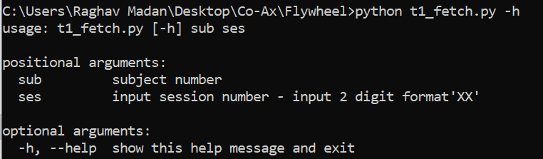
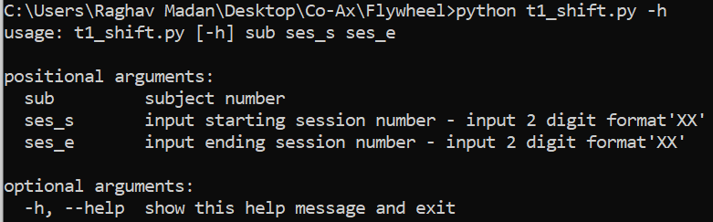

# T1w(anat) file shift in Flywheel

##Steps to set up-

- Setup Flywheel account, access and Api-key 
https://docs.flywheel.io/hc/en-us/articles/360019252953-CLI-fw-upload

- Download FW CLI to the target directory from profile settings of your Flywheel account

- Get access to loki1 repository and Download SSH key for Github for your system
https://help.github.com/en/articles/adding-a-new-ssh-key-to-your-github-account

- Open fw_file_path.txt and change the file path to the directory with FW CLI

- Ensure the particular subject and session with BIDS data exists in FW before running this script

- Create a folder “t1” in the Flywheel CLI directory.

- Modify the API key in **t1_fetch.py** and **t1_shift.py** to your own. 

##Initiate upload from command prompt-

- Open command prompt
- Login to Flywheel -  Fw login “api_key”
- Fetch t1 data from LOKICAT for the first time – **python t1_fetch.py -sub ” -sub “subject number” -ses “session number”**

- Run script to upload t1 files to LOKI1– **python t1_shift.py  -sub “subject number” -ses_s “starting session ”  -ses_e “ending session ”**

